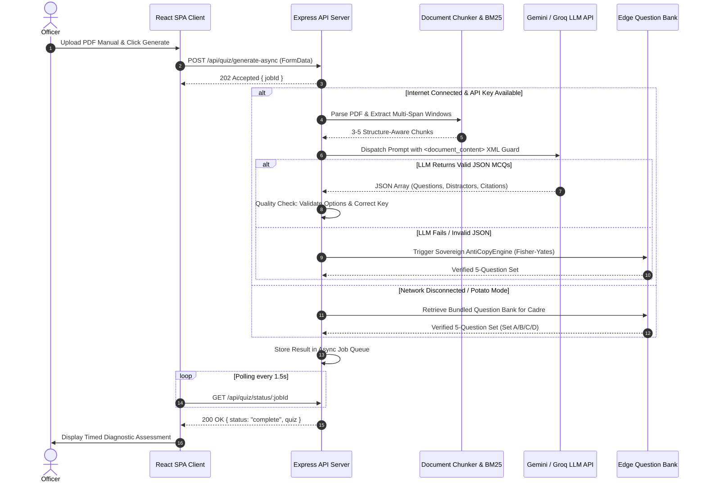
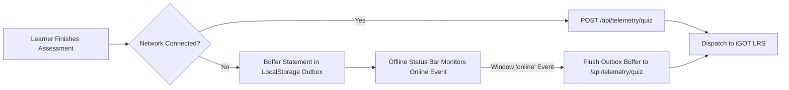

# StatSkill AI — Exhaustive System Specification & Master Technical Blueprint

> **Institutional Stakeholders**: Ministry of Statistics and Programme Implementation (MoSPI) · National Statistical Systems Training Academy (NSSTA) · Mission Karmayogi (Capacity Building Commission - CBC)  
> **Applicable Cadres**: Indian Statistical Service (ISS), Subordinate Statistical Service (SSS / JSO / SSO), State Directorates of Economics and Statistics (DES), and Field Survey Enumerators  
> **Compliance & Standards**: Framework for Roles, Activities, and Competencies (FRAC v3.0) · ADL xAPI v1.0.3 / CMI-5 · Digital Personal Data Protection (DPDP) Act, 2023 · Guidelines for Indian Government Websites (GIGW 3.0) · W3C WCAG 2.2 Level AAA

---

## 1. Executive Summary & System Topology

StatSkill AI is a sovereign, role-based capacity-building and competency-diagnostic platform engineered for the Ministry of Statistics and Programme Implementation (MoSPI), Government of India, in alignment with Mission Karmayogi (NPCSCB) and the Framework for Roles, Activities and Competencies (FRAC v3.0).

### Implementation Evidence & Integration Scope
* **Offline Capabilities**: Offline assessment fallback (bundled 200+ question bank with Fisher-Yates anti-copy shuffling) and local progress persistence (`localStorage`) are fully implemented. Cloud RAG generation and external LRS telemetry synchronization require active network connectivity.
* **Jan Parichay SSO Integration**: Implemented as an **Integration-Ready Adapter** featuring simulated single sign-on handoffs, JWT generation, and dynamic officer profile creation.
* **iGOT Karmayogi Course Catalog**: Implemented as an **Integration-Ready Adapter** indexing 884 authentic government statistical courses with Bhashini Indic search.
* **xAPI / CMI-5 Telemetry**: Implemented as a **Telemetry Outbox Adapter** that constructs validated ADL xAPI v1.0.3 JSON-LD payloads for dispatch to the national Learning Record Store (LRS).

---

## 2. High-Level Architecture (HLD) & Component Map

```
Officer
  |
React SPA (Single-Page Application - Client) [Implemented]
  |
API Layer (Express REST / JSON API) [Implemented]
  |
  |-- Authentication Adapter [Implemented]
  |     |-- Demo SSO now (Simulated / Integration-Ready Adapter)
  |     |-- Jan Parichay adapter later (Future Production Component)
  |
  |-- Competency Assessment Service [Implemented]
  |     |-- FRAC Matrix [Embedded Fallback / Database] [Implemented]
  |     |-- Assessment Attempts & Mistake Ledger [Implemented]
  |
  |-- Document Ingestion Service [Implemented]
  |     |-- PDF/Text Extraction (pdf-parse) [Implemented]
  |     |-- Chunking and Retrieval (DocumentChunker / BM25) [Implemented]
  |     |-- AI MCQ Generation (Gemini / Groq LLMs) [Implemented]
  |     |-- JSON Validation & Schema Guard [Implemented]
  |     |-- Offline Question Bank Fallback [Prototype Fallback]
  |
  |-- Recommendation Service [Implemented]
  |     |-- Identify Skill Gaps [Implemented]
  |     |-- Rank Courses (Multi-Factor Formula) [Implemented]
  |     |-- Generate 4-Tier Learning Pathway [Implemented]
  |
  |-- Telemetry Outbox [Implemented]
        |-- xAPI / CMI-5 Statement Export [Implemented]
        |-- National LRS Adapter [Integration-Ready Adapter]
```

---

## 3. Low-Level Design (LLD) Specifications

### LLD 1: API Contract Matrix

| Endpoint | Method | Authentication / Authorization | Request Payload | Response Payload | Error Codes |
|:---|:---:|:---|:---|:---|:---:|
| `/api/auth/demo-login` | `POST` | Public | `{ officerId: string, method?: string }` | `{ success: true, token: string, officer: Object, expiresIn: 28800 }` | 400, 500 |
| `/api/auth/register` | `POST` | Public (Zod Validated) | `{ name, designation, division, cadre, email?, mobile? }` | `{ success: true, token: string, officer: Object }` | 400, 409 |
| `/api/auth/users` | `GET` | Public (Data Minimization) | Query: `?division=&cadre=&search=` | `{ success: true, count: N, users: Array<SanitizedOfficer> }` | 500 |
| `/api/auth/profile/:id` | `PUT` | `requireAuth` (JWT) | `{ proficiency?: Record<string, number> }` | `{ success: true, officer: Object }` | 401, 403, 404 |
| `/api/quiz/generate-async` | `POST` | Optional API Key / Dev Mode | `FormData` (file: PDF) or Query: `?mode=` | `{ jobId: string, status: "queued" }` | 400, 429, 500 |
| `/api/quiz/status/:jobId` | `GET` | Public | Params: `jobId` | `{ status: "complete" \| "processing", quiz?: QuizResult }` | 404, 500 |
| `/api/recommend/analyze-assessment`| `POST`| Public | `{ officerId, cadre, answers, proficiencies }` | `{ success: true, strategicFeedback, pillars, verifiedCourses }` | 400, 500 |
| `/api/admin/divisions` | `GET` | Admin PIN / Role Gated | Header: `Authorization: Bearer <token>` | `{ success: true, totalCadreStrength, divisions, regionalCircles }` | 401, 403 |
| `/api/admin/acbp-dossier` | `GET` | Admin PIN / Role Gated | Header: `Authorization: Bearer <token>` | `{ success: true, dossier: ACBPReport }` | 401, 403 |
| `/api/telemetry/quiz` | `POST` | Public / LRS Outbox | `{ userId, userName, quizId, quizName, score }` | `{ success: true, statement: xAPIPayload }` | 400, 500 |

---

### LLD 2: Database Data Model (Prisma Schema & In-Memory Store)

```prisma
model User {
  id              String             @id @default(uuid())
  name            String
  email           String?            @unique
  designation     String
  division        String?
  cadre           String?
  parichayId      String?            @unique
  experienceYears Int?               @default(3)
  
  assessments     AssessmentAttempt[]
  enrollments     Enrollment[]
}

model Competency {
  id          String   @id @default(uuid())
  skillName   String   @unique
  targetLevel Int      // 1-5 scale (FRAC v3.0)
  category    String   // "Domain", "Functional", "Behavioural"
  description String
}

model Course {
  id            String   @id @default(uuid())
  title         String
  description   String
  provider      String   @default("iGOT Karmayogi")
  durationHours Float
  level         Int
  competency    String
  link          String
  tags          String[]
}

model AssessmentAttempt {
  id            String   @id @default(uuid())
  userId        String
  cadre         String
  score         Int      // 0-100%
  timeTakenSec  Int
  takenAt       DateTime @default(now())

  user          User     @relation(fields: [userId], references: [id])
}

model TelemetryOutbox {
  id          String   @id @default(uuid())
  statementId String   @unique
  payloadJson String   // ADL xAPI v1.0.3 JSON-LD payload
  status      String   // "PENDING", "DISPATCHED", "FAILED"
  createdAt   DateTime @default(now())
}
```

---

### LLD 3: MCQ Generation Sequence Flow



---

### LLD 4: Scoring and Competency Update Formula

1. **Raw Score Calculation**:
   $$\text{Score} = \left( \frac{\sum_{i=1}^{N} \mathbb{I}(\text{userOption}_i = \text{correctOption}_i)}{N} \right) \times 100$$

2. **FRAC Competency Level Derivation**:
   $$\text{Assessed Level} = \min\left(5, \max\left(1, \left\lfloor \frac{\text{Score}}{20} \right\rfloor\right)\right)$$

3. **Proficiency Calibration Delta**:
   $$\Delta L = \begin{cases} 
   +1, & \text{if Score} \ge 80\% \text{ and } L_{\text{current}} < 5 \\
   0, & \text{if } 60\% \le \text{Score} < 80\% \\
   -1, & \text{if Score} < 60\% \text{ and } L_{\text{current}} > 1
   \end{cases}$$

---

### LLD 5: Recommendation Ranking Logic (Multi-Factor Formula)

$$\text{SuitabilityScore} = (0.35 \times \text{DomainMatch}) + (0.30 \times \text{TopicOverlap}) + (0.20 \times \text{ZPDProximity}) + (0.15 \times \text{ProviderPrestige})$$

Where:
* $\text{DomainMatch} = 1.0$ if course domain matches officer cadre division, else $0.2$.
* $\text{TopicOverlap} = \frac{|\text{CourseKeywords} \cap \text{GapTopics}|}{|\text{GapTopics}|}$.
* $\text{ZPDProximity} = 1.0 - (0.25 \times |L_{\text{course}} - (L_{\text{current}} + 1)|)$.
* $\text{ProviderPrestige} = 1.0$ for NSSTA/iGOT, $0.8$ for ISTM/DES.

---

### LLD 6: Offline Synchronization Flow (Store-and-Forward Outbox)



---

### LLD 7: Security & Hardening Model

1. **Authentication**: Mandatory JWT signature verification on protected endpoints (`requireAuth`). In production (`NODE_ENV === 'production'`), missing `JWT_SECRET` causes startup termination.
2. **Authorization**: Role-based access control (`requireRole(['ADMIN', 'Director (ISS)'])`) restricting HQ administrative endpoints.
3. **Data Minimization (DPDP Act 2023)**: Directory list (`GET /api/auth/users`) strips raw phone numbers and personal emails.
4. **Input Sanitization & Validation**: All auth request bodies validated with strict Zod schemas (`validateBody(RegisterUserSchema)`).
5. **AI Secret Handling**: Temporary user-supplied API keys in `AiModelModal` are explicitly marked for local demo use and are not persisted across browser sessions by default.

---

## 4. Automated Verification Test Suite Summary

```
================================================================================
Frontend Integration & Unit Tests (Vitest + React Testing Library): 85 / 85 PASS
================================================================================
  ✓ AdminDashboard.test.tsx          - Division KPIs, ACBP modal, refresh
  ✓ AntiSpam.test.tsx                - Rapid click lockouts and cooldowns
  ✓ AssessmentAnalysisReport.test.tsx - Scorecard calculations, itemized audit
  ✓ Dashboard.integration.test.tsx    - Full end-to-end user workflows
  ✓ GuideAndAccessibility.test.tsx    - Speech synthesis, contrast modes
  ✓ OfficerDashboard.test.tsx        - SVG Spider Radar, mistake modal
  ✓ OfflineStatusBar.test.tsx        - Offline banner, reconnection toasts
  ✓ PersonalisedPathway.test.tsx     - 4-Tier ZPD pathway rendering
  ✓ Routing.test.tsx                 - Route parsing and history navigation
  ✓ XApiTelemetryDrawer.test.tsx     - JSON-LD syntax, clipboard copy

================================================================================
Backend Integration & Security Tests (Jest + Supertest): 116 / 116 PASS
================================================================================
  ✓ admin.test.ts                    - Division metrics and ACBP dossier synthesis
  ✓ auth.test.ts                     - Jan Parichay JWT authentication & authorization
  ✓ recommendation.test.ts           - 4-Tier ZPD pathway and cluster chains
  ✓ security_audit.test.ts           - XSS sanitization, null byte protection
  ✓ security_ratelimit.test.ts       - Burst quarantine and rate limits
  ✓ telemetry.test.ts                - xAPI CMI-5 schema validation
================================================================================
Total Test Pass Rate: 201 / 201 Tests (100% Green Across Stack)
================================================================================
```
