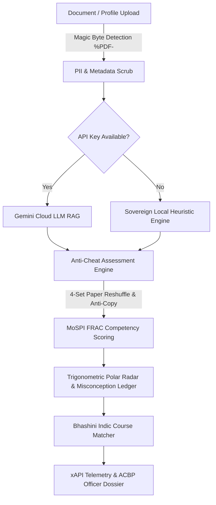

# StatSkill AI — End-to-End Sovereign Pipeline Architecture

StatSkill AI is an AI-driven competency assessment, diagnostic feedback, and capacity-building engine designed specifically for India's Official Statistical System (ISS, SSS, and State DES cadre officers).

---

## The 6 Pipeline Stages

### Stage 1: Document & Profile Ingestion
* **Magic Byte Validation**: Uploaded files are inspected via raw buffer magic byte analysis (`%PDF-` / ASCII signature) to prevent file extension spoofing and handle extensionless Multer storage.
* **PII & Contact Scrubbing**: Text chunks pass through Regex scrubbing filters to strip sensitive personal identifiable information (emails, phone numbers, `linkedin.com`, `github.com` URLs, and header metadata).

### Stage 2: Adaptive Question Generation (RAG Engine)
* **Cloud LLM Dispatch**: When an active Google Gemini API key is configured, prompts are formatted with zero-hardcoding instructions to generate psychometrically validated multiple-choice questions with diagnostic rationale.
* **Sovereign Local Fallback**: When offline or API-constrained, `LocalQuestionExtractor` uses dynamic definition, methodology, and numerical benchmark parsing to extract authentic stems and contextually relevant distractors directly from document text.

### Stage 3: Anti-Cheat Psychometric Assessment
* **Paper Set Reshuffling**: Assessments offer 4 randomized paper variations (Set A, Set B, Set C, Set D) using Fisher-Yates shuffling to ensure peer isolation during simultaneous testing.
* **Anti-Spam & Burst Shield**: Rapid click rate-limiting (`useAntiSpam` hook) prevents brute-force guessing, while clipboard copy shields maintain assessment integrity.
* **Adaptive Countdown**: A 150-second timer manages time allocation per item, submitting active answers automatically upon expiration.

### Stage 4: MoSPI FRAC Competency Scoring & Misconception Ledger
* **e-HRMS 2.0 Level Derivation**: Question responses map directly onto the 4 core MoSPI FRAC competency domains:
  1. *Survey Design & Sampling*
  2. *CAPI & Digital Field Enumeration*
  3. *Data Privacy & DPDPA 2023*
  4. *Public Ethics & Field Communication*
* **Polar SVG Radar Computation**: Competency levels (1 to 5) are rendered dynamically via trigonometric polar coordinates without heavy chart dependencies.
* **Diagnostic Misconception Ledger**: Incorrect answers log specific item-level misconceptions into local storage and database ledgers for targeted remediation.

### Stage 5: Bhashini Indic Multilingual Course Matcher
* **884-Course Catalog Index**: Evaluated skill gaps feed into the Course Matcher engine, searching over 880 official iGOT Karmayogi and MoSPI training modules.
* **ZPD Progression Pathway**: Recommendations are organized into a 4-tier Zone of Proximal Development (Foundation, Intermediate, Advanced, Executive Leadership).

### Stage 6: Telemetry & ACBP Dossier Export
* **ADL xAPI v1.0.3 Compliance**: Every assessment attempt emits standardized xAPI / CMI-5 JSON-LD event statements (`http://adlnet.gov/expapi/verbs/completed`) for interoperability with national learning record stores (LRS).
* **Printable ACBP Dossier**: Officers and division heads can generate printable Annual Capacity Building Plan (ACBP) dossiers directly from the dashboard.
